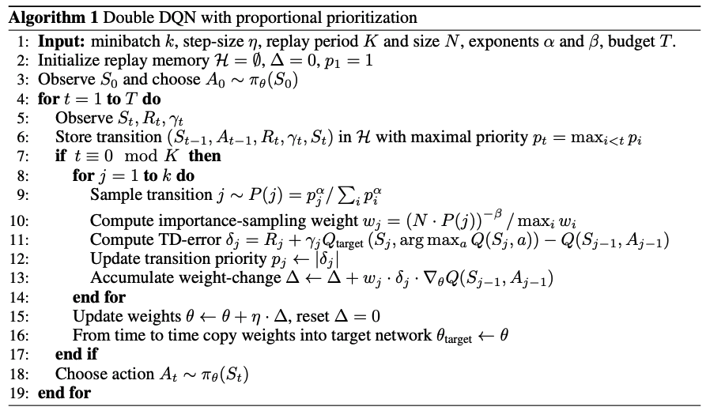

# PER 구현하기


이번에는 `Prioritized Experience Replay` 을 구현해보도록 하겠습니다.
모든 코드는 <https://github.com/g6ling/Reinforcement-Learning-Pytorch-Cartpole> 에 있습니다.

## 논문
<https://arxiv.org/pdf/1511.05952.pdf>

### 기본내용
기본 개념은 더 중요한 경험이 있다면 그걸 더 자주 활용하자는 것 입니다. 여기서 중요한 건 `중요한 경험` 이라는 기준입니다.
이 논문에서는 `Error` 가 클수록 더 중요하다고 합니다.

$$ error= |Q(s,a) - (reward + argmax_aQ(s', a'))| $$

DQN 에서 사용하였던 `TD-Error` 이 더 큰 경험을 더 중요하게 여긴다는 것 입니다. 

즉, 예상이 많이 빗나간 경험일수록 다음 예상에 더 많은 도움을 줄 수 있다는 것이죠.

각각의 경험이 선택될 확률을

$$ P(experience_i) = \frac {|error_i|} {\sum_j |error_j|} $$

로 정의 합니다.

## 실제 구현
구현 법에는 3가지 방법이 있습니다.
### 단순 구현법

```js
# 1. 모든 td_error의 합을 구한다.
sum_td_error = sum(abs(td_error) for td_error in td_errors))

# 2. 0 ~ sum_td_error 사이의 랜덤한 숫자를 고른다.
random_number = np.random.uniform(0, sum_td_error) 

# 3. 랜덤한 idx을 고른다.
# 이미지 상으로는 전체 끈이 있고 각각의 td 값 만큼 각기 다른 색으로 색칠
# 그 뒤에 랜덤한 길이의 부분을 고른다는 느낌.
tmp_sum_error = 0
idx = 0
while tmp_sum_error < random_number:
	tmp_sum_error += abs(td_errors[idx])
	idx += 1

memory.push(idx)

# 3을 여러번 반복하여서 memory에 batch_size 만큼 experience을 넣은 후 그걸 이용해서
# replay 나머지는 같음
```

### Segment Tree 구현법
대부분의 코드에서 이 방법으로 많이 구현합니다. 시간복잡도가 다른 방법은 `O(n)` 이지만 이 방법은 `O(logn)` 이기 때문이지요.

여기 글에서 Segment Tree 에 대해서 설명할려면 길어 지기 때문에 적당히 구글에서 검색하시는 편이 좋을 것 같습니다.

### Numpy random choice 을 사용한 구현

```js
td_sum = sum(self.td_memory)
p = [td_error / td_sum for td_error in self.td_memory]
indexes = np.random.choice(np.arange(len(self.memory)), batch_size, p=p)
transitions = [self.memory[idx] for idx in indexes]
```

가장 간단한 방법입니다. 저 같은 경우는 별로 성능이 중요하지 않을 때는 위의 방법으로 많이 구현합니다. 어차피 대부분의 bottleneck 은 여기에서 걸리는게 아니기 때문에 큰 문제는 없는것 같습니다.


