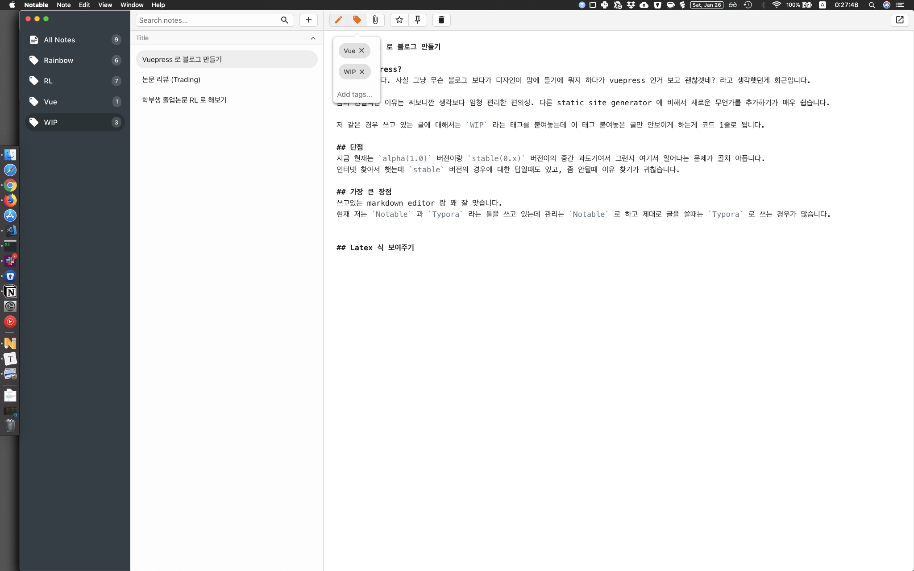

# Vuepress 로 블로그 만들기

## 왜 Vuepress?
그러게 말입니다. 사실 그냥 무슨 블로그 보다가 디자인이 맘에 들기에 뭐지 하다가 vuepress 인거 보고 괜찮겟네? 라고 생각햇던게 화근입니다.

좀더 현실적인 이유는 써보니깐 생각보다 엄청 편리한 편의성. 다른 static site generator 에 비해서 새로운 무언가를 추가하기가 매우 쉽습니다.

저 같은 경우 쓰고 있는 글에 대해서는 `WIP` 라는 태그를 붙여놓는데 이 태그 붙여놓은 글만 안보이게 하는게 코드 1줄로 됩니다.

## 단점
지금 현재는 `alpha(1.0)` 버전이랑 `stable(0.x)` 버전이의 중간 과도기여서 그런지 여기서 일어나는 문제가 골치 아픕니다.
인터넷 찾아서 햇는데 `stable` 버전의 경우에 대한 답일때도 있고, 좀 안될때 이유 찾기가 귀찮습니다.

## 가장 큰 장점
쓰고있는 markdown editor 랑 꽤 잘 맞습니다.
현재 저는 `Notable` 과 `Typora` 라는 툴을 쓰고 있는데 관리는 `Notable` 로 하고 제대로 글을 쓸때는 `Typora` 로 쓰는 경우가 많습니다.



이렇게 쉽게 Tag 관리도 되면서 제가 쓰고 있는 글들에 대한 관리도 매우 쉽습니다. 이미지 추가 같은 것도 매우 쉽게 할 수 있습니다.


## 만들면서 알면 괜찮은 지식들

### Plug-in 들 버전을 맞추어야 한다.
아마 단순하게 `yarn add @vuepress/~~~` 을 할 경우 옛날 버전이 설치 될수 있습니다.
자신의 `vuepress` 버전을 보고 같은 버전의 plugin 을 설치합시다.

```js
{
  "devDependencies": {
    "@vuepress/plugin-back-to-top": "^1.0.0-alpha.0.32",
    "@vuepress/plugin-blog": "^1.0.0-alpha.0.32",
    "@vuepress/plugin-medium-zoom": "^1.0.0-alpha.0",
    "markdown-it": "^8.4.2",
    "markdown-it-katex": "^2.0.3",
    "vuepress": "^1.0.0-alpha.32"
  },
  "scripts": {
    "dev": "vuepress dev docs",
    "build": "vuepress build docs"
  }
}

```
요렇게 합시다. vuepress 같은 경우도 그냥 로컬에 설치하는게 나은 것 같습니다.

### @vuepress/plugin-blog 는 뭔가 이상하다
Layout 에 맞춰서 보여주는데 이게 component 는 안되고 무조건 Layout 폴더있어야 합니다.
즉 모든 태그를 보여주는 `Tag.vue` 가 무조건 layouts 에 있어야 합니다.

제대로 사용하기 위해서는 theme 을 `eject` 한뒤에 사용해야 하는데 이게 `eject` 한다는 거에서 점점 간단한 사용과는 거리가 멀어지는 것 같습니다.

일단 plugin-blog 을 사용하기 위해서 `vuepress eject docs` 을 합니다.

그러면 `theme` 폴더가 생기는데 `layouts` 밑에

  `Tag`, `Tags`, `Category`, `Categories`, `Post`, `Page`, `Layout` 이라는 vue 파일을 만들면 그에 알맞게 화면이 보여집니다.
  
  `Tags`는 전체 Tag 의 페이지
  `Tag` 는 개별 Tag 의 페이지
  `Categories` 는 전체 category 페이지
  `Category` 는 개별 category 페이지
  `Post` 는 각각의 블로그 글들
  `Layout`는 home 화면
  `Page` 는 그 외의 화면들 입니다.
  
  `Tag, Tags, Category, Categories, Post` 가 존재 하지 않으면 `Page`로 전부다 출력하고
  `Page`도 존재하지 않으면 `Layout`으로 출력합니다.

이 부분에 대해서는 다음글에 좀더 자세히 설명하겠습니다.

## 한글 파일명 문제
markdown 파일 이름이 한글이면 뒤로가기를 할때 패스를 제대로 못찾는 경우가 있습니다. 때문에 항상 영어로 이름을 지어야 합니다.

## Latex 식 보여주기

## 도움되는 블로그
https://62che.com/blog/
https://limdongjin.github.io/vuejs/vuepress/
